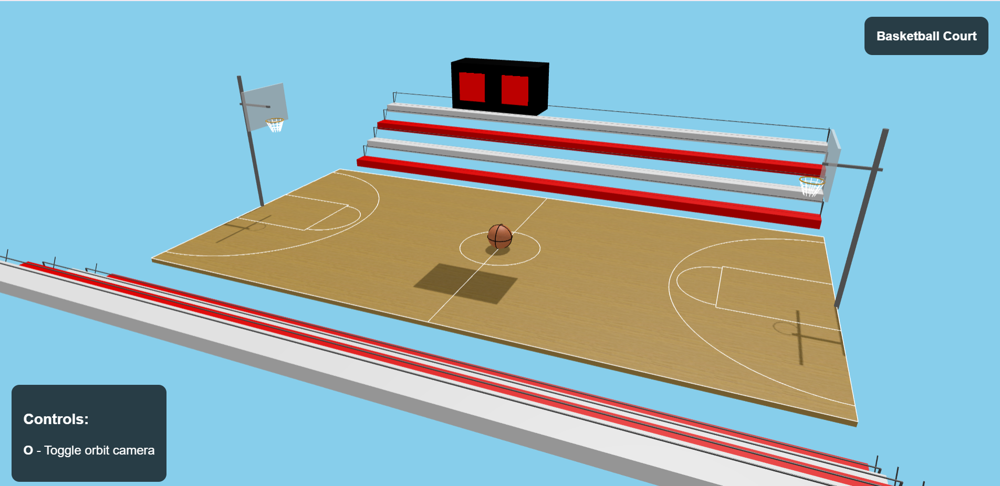
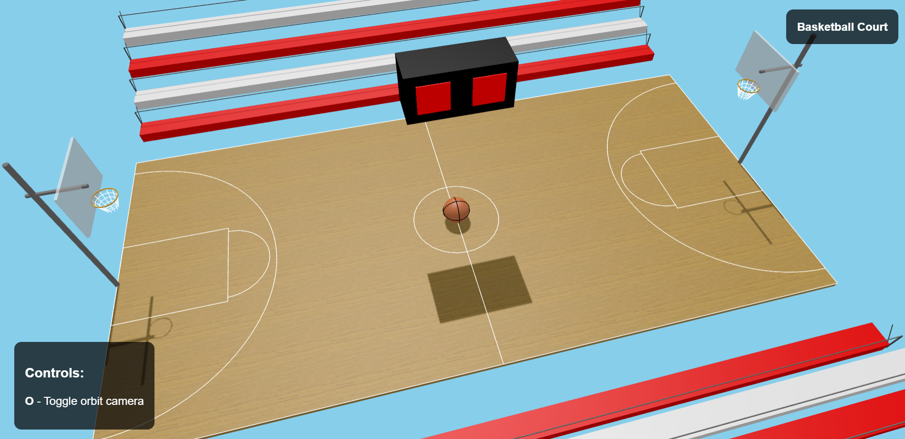

# Computer Graphics - Exercise 5 - WebGL Basketball Court

# 🏀 Basketball Court Scene – WebGL Demo

This project renders a realistic basketball court with hoops, markings, lighting, and a floating ball. It includes interactive camera controls and a foundation for future UI integration.

---

## ✅ Component Status

| Component                | Status | Notes                                                                 |
|--------------------------|--------|-----------------------------------------------------------------------|
| Court surface & markings | ✅     | All required lines                                                   |
| Two complete hoops       | ✅     | Backboard, rim, 8‑segment net, pole & support arm                    |
| Static basketball        | ✅     | Sphere, realistic seams, and added texture at center court           |
| Camera & lighting        | ✅     | Directional + ambient lights, shadows, OrbitControls (toggle `O`)    |
| UI framework             | ✅     | HTML containers for future score & controls, responsive CSS          |

---
## 🎁 Bonus Features

- **Scoreboard**: Mounted scoreboard area prepared for game stats and timer display.
- **Bleachers with railing**: Tiered seating added on both sides for audience, with safety railing modeled.
- **Court detail enhancements**:
  - **Restricted area arc** (semi-circle under the hoop)
  - **Free-throw lines** and key 
  - **Out-of-bounds lines** clearly marked on all sides
---

## 🕹️ Controls

- Press **`O`** to toggle Orbit camera control.
- Use mouse or touch to rotate, pan, and zoom when Orbit is active.

## 📸 How to run
1. Clone this repository to your local machine
2. Make sure you have Node.js installed
3. Start the local web server: `node index.js`
4. Open your browser and go to http://localhost:8000

Feel free to clone and customize this court to suit your own game or simulation!

---
## 📷 Gallery

Here are some additional views from the scene:

### 🏀 Ball

### 🏀 Hoop (Side view)

### 🏀 Hoop (Top view)

---

## Group Member
- Hila Ashkenazy
